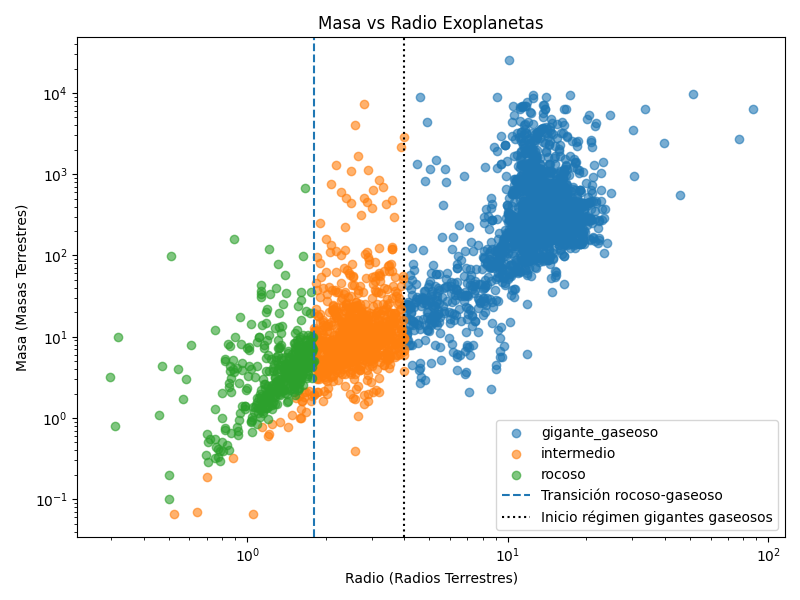

# Proyecto 1: Minería de Datos

## Relación Masa-Radio en Exoplanetas

El objetivo de este proyecto es analizar la relación entre la masa y el radio de exoplanetas confirmados usando datos del **NASA Exoplanet Archive**, con el fin de identificar la transición física entre planetas rocosos densos y planetas gaseosos con envolturas extendidas.

Este fenómeno es clave en astrofísica planetaria, ya que permite comprender la estructura interna y los procesos de formación planetaria.

### Pipeline

Para reproducir el análisis se debe ejecutar el archivo pipeline.sh, el cual realiza automáticamente lo siguiente:

- Descarga datos observacionales del **NASA Exoplanet Archive**
- Filtra los datos y construye una base de datos SQLite local con ayuda del archivo constructor_db.py
- Abre los datos como un dataframe, realiza un análisis de los datos y produce la gráfica final con ayuda del archivo analisis_visual.py

### Resultado

La siguiente figura muestra la relación Masa vs Radio para los exoplanetas de la base de datos:

Los ejes están en escala logarítmica para resaltar las distintas poblaciones planetarias. Las líneas verticales en $R_\oplus=1.8$ y $R_\oplus=4$ representan los límites entre los regímenes de planetas rocosos, mini neptunos y gigantes gaseosos.

Se dividen los planetas en tres grupos: rocosos y densos, intermedios (mini-Neptunos) y gigantes gaseosos. Para determinar en cuál grupo se encuentra cada planeta, se calculó su densidad a partir de los datos de radio y masa, y se clasifican de la siguiente manera:

- Si $R < 1.8 R_\oplus$ y $\rho > 3 \ \text{g cm}^{-3}$ se clasifica como planeta rocoso y denso
- Si $R > 4 R_\oplus$ se clasifica como gigante gaseoso
- Para los demás casos se toma como un planeta intermedio, correspondiente al régimen de los mini-Neptunos

Las densidades fueron determinadas de la forma:

$$
\rho \approx \frac{M}{R^3} \rho_\oplus
$$

Tomando $\rho_\oplus = 5.51 \ \text{g cm}^{-3}$

### Interpretación Física

- Los planetas clasificados como rocosos son planetas que presentan altas densidades medias, consistentes con composiciones predominantemente rocosas similares a la Tierra o supertierras.
- Los planetas clasificados como intermedios representan una población de planetas con densidades menores, interpretados como mini-Neptunos o planetas con envolturas gaseosas significativas.
- Los planetas clasificados como gigantes gaseosos son planetas para los que la masa no crece proporcionalmente a $R^3$, lo que indica densidades medias bajas características de gigantes gaseosos dominados por hidrógeno y helio.

Por lo tanto, la transición principal entre planetas rocosos y gaseosos ocurre alrededor de $R \approx 2 R_\oplus$. Este análisis de datos observacionales confirma que la relación masa-radio permite distinguir diferentes clases planetarias, y podría proporcionar evidencias sobre los procesos de formación y evolución de sistemas planetarios.
